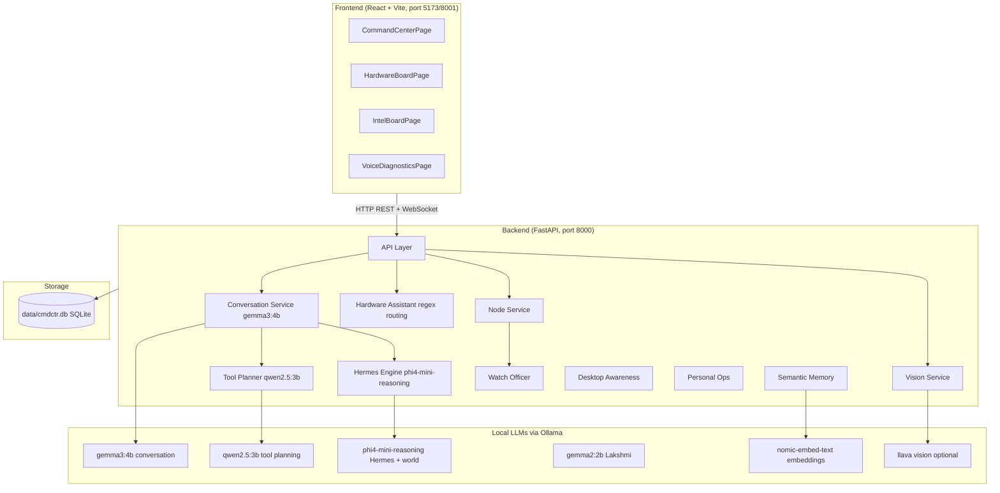
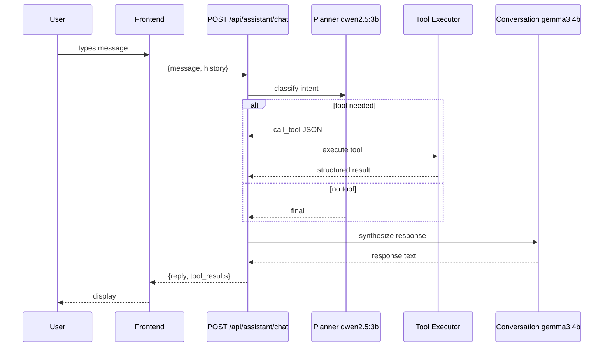
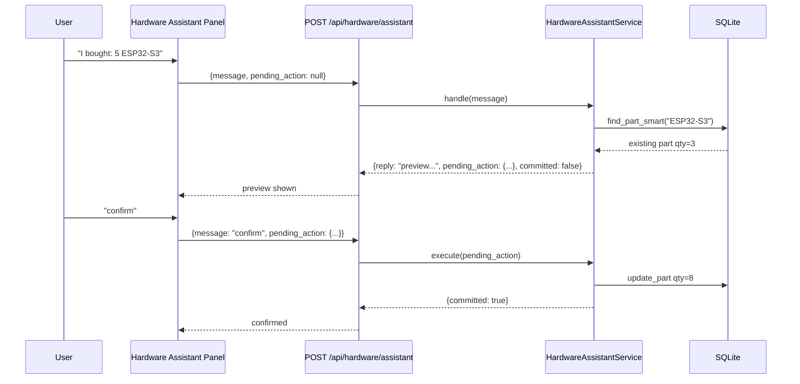
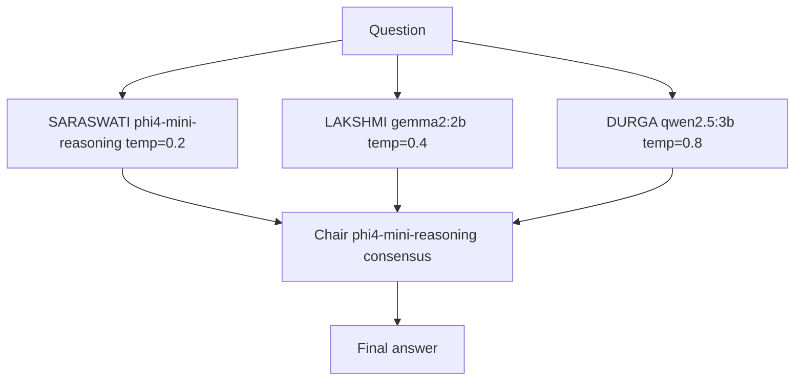
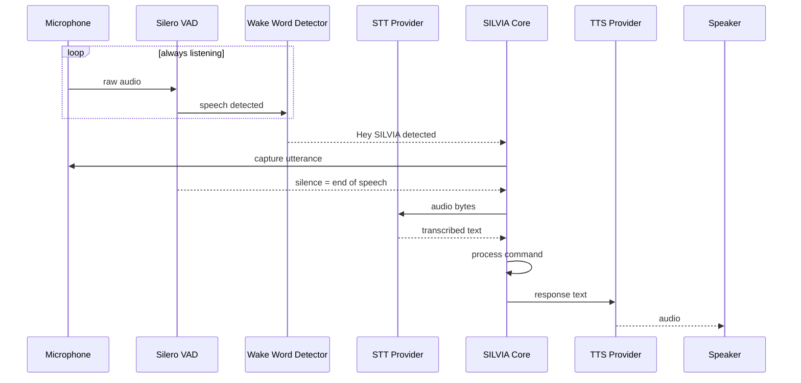
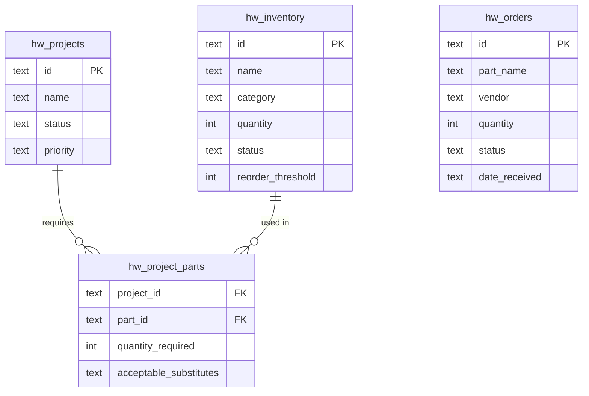
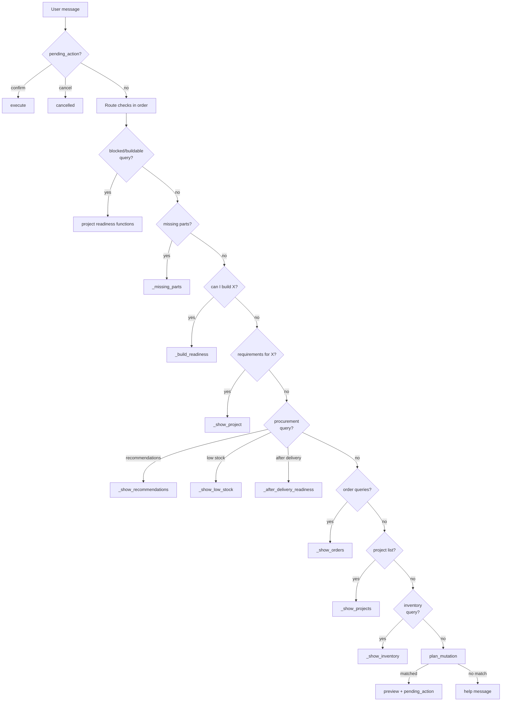
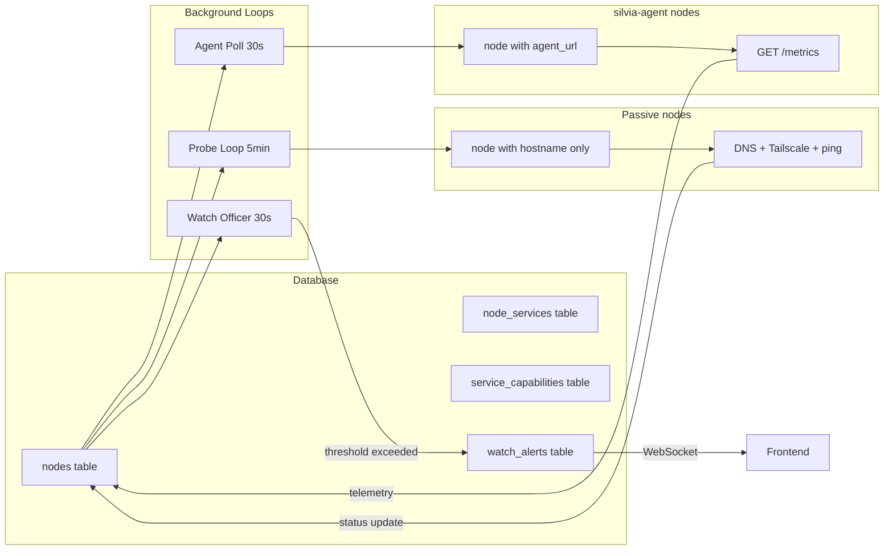

# SILVIA Architecture

## Table of Contents

1. [System Overview](#system-overview)
2. [Frontend → Backend Data Flow](#frontend--backend-data-flow)
3. [LLM Routing](#llm-routing)
4. [Voice Pipeline](#voice-pipeline)
5. [Hardware Board Architecture](#hardware-board-architecture)
6. [Node Registry Architecture](#node-registry-architecture)
7. [Database Schema](#database-schema)
8. [Background Loops](#background-loops)

---

## System Overview



---

## Frontend → Backend Data Flow

### Chat Request



### Hardware Assistant — Preview/Confirm Flow



### WebSocket Events

The frontend connects to `ws://{host}:8000/api/ws/events` on page load. Events are pushed from background loops:

| Event Type | Payload | Triggered by |
|---|---|---|
| `node_telemetry` | `{node_id, cpu, ram, disk, battery, ...}` | Agent poll loop every 30s |
| `watch_alert` | `{severity, message, category}` | Watch Officer rule match |
| `reminder_due` | `{message, escalation_level}` | Reminder loop |

---

## LLM Routing

| Model | Role | Temperature | Why |
|---|---|---|---|
| `qwen2.5:3b` | Tool planner | 0.7 | Fast structured JSON output |
| `gemma3:4b` | Conversation | — | Natural language synthesis |
| `phi4-mini-reasoning` | World model + Hermes | 0.2 | Structured reasoning, multi-step |
| `gemma2:2b` | Lakshmi debate brain | 0.4 | Balanced second opinion |
| `qwen2.5:3b` | Durga debate brain | 0.8 | Contrarian high-temperature |
| `nomic-embed-text` | Embeddings | — | Semantic memory search |
| `llava` | Vision (optional) | — | Component detection from images |

### Planner Output Shapes

```json
// Single tool
{"action": "call_tool", "name": "get_weather", "args": {"place": "london"}}

// Multiple tools in parallel
{"action": "call_tools", "calls": [
  {"name": "get_time_in", "args": {"place": "london"}},
  {"name": "get_weather", "args": {"place": "london"}}
]}

// No tool — send directly to conversation model
{"action": "final"}
```

### MAGI Council — Debate Mode



---

## Voice Pipeline



**Provider selection:**

```
SPEACHES_URL set? → Speaches (faster-whisper-large-v3-turbo + Kokoro TTS)
               NO → local Whisper (base) + Piper TTS
```

---

## Hardware Board Architecture

### Entity Relationships



### Hardware Assistant Routing



---

## Node Registry Architecture



---

## Database Schema

All tables in `data/cmdctr.db`. Created automatically, migrated safely with `ALTER TABLE ADD COLUMN`.

| Table | Purpose |
|---|---|
| `nodes` | Node registry with telemetry |
| `node_services` | Services on each node |
| `service_capabilities` | Capabilities per service |
| `watch_alerts` | Watch Officer alert log |
| `tasks` | Personal task list |
| `reminders` | Timed reminders with escalation |
| `calendar_events` | Calendar |
| `projects` | Mission Control project registry |
| `conversation_memory` | Semantic memory (text + embedding) |
| `hw_inventory` | Hardware component inventory |
| `hw_projects` | Hardware build projects |
| `hw_project_parts` | BOM links (project ↔ component) |
| `hw_orders` | Procurement orders |
| `hw_imports` | BOM/inventory import log |
| `locations` | Trusted filesystem locations |
| `app_registry` | Discovered applications |
| `launch_preferences` | Open-target preferences |
| `scheduled_tasks` | Hermes cron tasks |

---

## Background Loops

All run as `asyncio` tasks from `backend/app/core/application.py`:

| Loop | Interval | Purpose |
|---|---|---|
| Agent poll | 30s | Fetch live telemetry from silvia-agent nodes |
| Node probe | 5 min | DNS/Tailscale/ping verification for passive nodes |
| Watch Officer | 30s | Evaluate threshold rules, emit alerts, push WebSocket |
| Reminder checker | 60s | Due reminders, escalation (24h → warning, 72h → critical) |
| Scheduled task runner | 60s | Execute due Hermes tasks |
| RSS ingestor | 15 min | Pull world intelligence RSS feeds |
