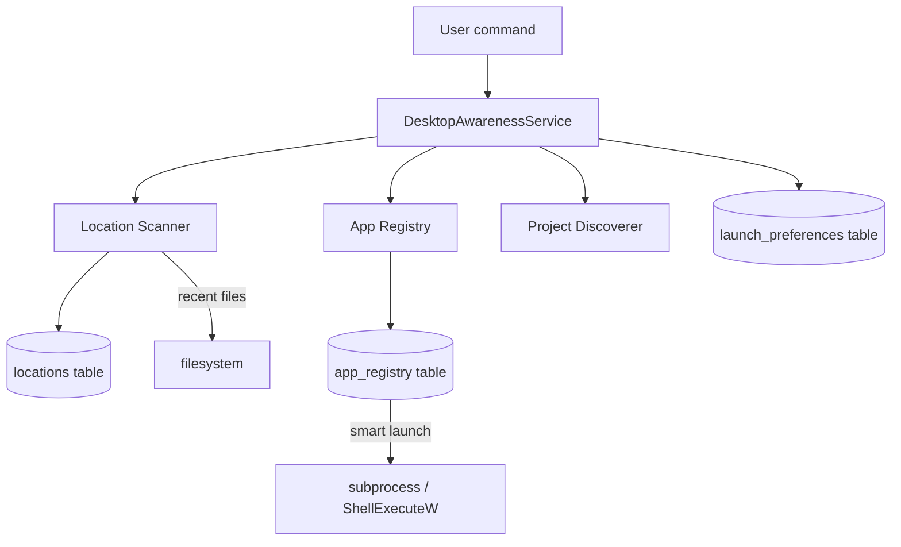

# SILVIA Desktop Awareness — Complete Guide

Desktop Awareness gives SILVIA knowledge of your filesystem and installed applications, enabling file and app discovery, smart launching, and recent-file access via natural language.

## Table of Contents

1. [Overview](#overview)
2. [Architecture](#architecture)
3. [App Discovery](#app-discovery)
4. [File Indexing](#file-indexing)
5. [Location Registry](#location-registry)
6. [Project Discovery](#project-discovery)
7. [Launch Preferences](#launch-preferences)
8. [Runtime Tracking](#runtime-tracking)
9. [All Commands](#all-commands)
10. [API Reference](#api-reference)
11. [Configuration](#configuration)

---

## Overview

Desktop Awareness consists of three systems:

| System | Purpose |
|---|---|
| **App Registry** | Knows where applications are installed and how to open file types |
| **File Indexing** | Scans trusted locations to discover files by name/type |
| **Project Discovery** | Finds local code repos and active projects |

Everything is stored in `data/cmdctr.db` in three tables: `locations`, `app_registry`, `launch_preferences`.

---

## Architecture



---

## App Discovery

### How It Works

App discovery scans trusted locations for executable files (`.exe`, `.bat`, `.cmd` on Windows) and builds an index of installed applications:

1. **Trusted locations** — user-registered directories (e.g. `C:\Program Files`, `C:\Users\user\AppData\Roaming`)
2. **Name normalization** — app names are lowercased and stripped of version numbers and common suffixes
3. **Path deduplication** — multiple paths for the same logical app are deduplicated, keeping the most recent
4. **Type mapping** — apps are associated with file extensions they can open (based on Windows registry + known patterns)

### Registering Trusted Locations

```
add location C:\Program Files
add location C:\Program Files (x86)
add location C:\Users\user\AppData\Roaming
add location D:\Applications
```

### Scanning for Applications

```
scan applications
discover apps
refresh app list
```

Scan walks every trusted location looking for executables. Results stored in `app_registry`.

### Listing Known Applications

```
list apps
show apps
what applications do you know about
```

---

## File Indexing

### Trusted Locations

Only directories explicitly registered via `add location` are scanned. SILVIA never reads outside trusted locations.

```
show locations
list trusted locations
```

### Finding Files

```
find file invoice.pdf
find all PDFs
find Python files
find recent files
show files in Documents
```

File search uses the filesystem directly (no pre-built index) with restricted scope to trusted locations.

### Opening Files

```
open invoice.pdf
open resume.docx
open C:\Documents\notes.txt
```

SILVIA selects the best application based on:
1. File extension
2. `launch_preferences` table (if user has set a preference)
3. Windows default association (ShellExecuteW fallback)

---

## Location Registry

### Schema

| Column | Type | Description |
|---|---|---|
| `id` | TEXT PK | 8-char UUID |
| `path` | TEXT | Absolute filesystem path |
| `label` | TEXT | Human label (e.g. "Documents") |
| `scan_for_apps` | INT | 1 = scan for executables |
| `scan_for_files` | INT | 1 = include in file search |
| `created_at` | TEXT | ISO timestamp |

### Commands

```
add location C:\Users\user\Documents
add location C:\Projects label:Projects
remove location C:\OldStuff
show locations
list trusted locations
```

---

## Project Discovery

### How It Works

Project discovery scans trusted locations for directories containing any of:
- `.git` — git repository
- `package.json` — Node.js project
- `pyproject.toml`, `setup.py`, `requirements.txt` — Python project
- `Cargo.toml` — Rust project
- `go.mod` — Go project
- `.sln`, `.csproj` — .NET project

Discovered projects are NOT stored in the Mission Control project registry (which is for hardware/task projects). Desktop project discovery is purely for filesystem awareness.

### Commands

```
discover projects
find code projects
show local projects
what projects do I have
```

Returns a list of discovered project directories with their detected type and last modified time.

---

## Launch Preferences

### How It Works

When you open a file or project type, SILVIA may ask which app you prefer. Your answer is stored in `launch_preferences` so SILVIA doesn't ask again.

| Column | Type | Description |
|---|---|---|
| `id` | TEXT PK | 8-char UUID |
| `target_pattern` | TEXT | File pattern (e.g. `*.py`, `*.pdf`) |
| `app_id` | TEXT FK | Preferred app from `app_registry` |
| `created_at` | TEXT | ISO timestamp |

### Setting Preferences

```
open Python files with VS Code
set default for .pdf to Adobe Acrobat
always open .md files with Obsidian
```

### Viewing Preferences

```
show launch preferences
what opens Python files
```

### Clearing Preferences

```
clear preference for .pdf
reset launch preference for Python files
```

---

## Runtime Tracking

SILVIA can query which applications are currently running via Windows process enumeration (`psutil`):

```
what's running
show running apps
is VS Code open
is Obsidian running
```

Returns: process name, PID, CPU%, memory usage.

### Bringing Apps to Foreground

```
switch to VS Code
bring VS Code to front
focus Obsidian
```

Uses Win32 `SetForegroundWindow` (requires the process to be minimized, not hidden).

---

## All Commands

### Location Management

| Command | Description |
|---|---|
| `add location <path>` | Register a trusted location |
| `add location <path> label:<name>` | Register with a custom label |
| `remove location <path>` | Unregister a location |
| `show locations` | List all trusted locations |

### App Discovery

| Command | Description |
|---|---|
| `scan applications` | Discover executables in trusted locations |
| `list apps` | Show all known applications |
| `find app <name>` | Search for a specific app |

### File Operations

| Command | Description |
|---|---|
| `find file <name>` | Search for a file by name |
| `find <type> files` | Search by type (e.g. "find PDF files") |
| `find recent files` | Files modified in the last 7 days |
| `open <filename>` | Open a file with preferred app |
| `open <path>` | Open a file at absolute path |

### Project Discovery

| Command | Description |
|---|---|
| `discover projects` | Scan for code repositories |
| `show local projects` | List discovered projects |
| `open project <name>` | Open project folder |

### Launch Preferences

| Command | Description |
|---|---|
| `open <ext> files with <app>` | Set launch preference |
| `show launch preferences` | List all preferences |
| `clear preference for <ext>` | Remove a preference |

### Runtime

| Command | Description |
|---|---|
| `what's running` | List running processes |
| `is <app> running` | Check if specific app is open |
| `switch to <app>` | Bring app to foreground |

---

## API Reference

| Method | Endpoint | Description |
|---|---|---|
| GET | `/api/desktop/locations` | List trusted locations |
| POST | `/api/desktop/locations` | Add location |
| DELETE | `/api/desktop/locations/{id}` | Remove location |
| GET | `/api/desktop/apps` | List known apps |
| POST | `/api/desktop/scan` | Trigger app scan |
| GET | `/api/desktop/files` | Search files (query, type params) |
| POST | `/api/desktop/open` | Open file or app |
| GET | `/api/desktop/projects` | List discovered projects |
| GET | `/api/desktop/running` | List running processes |
| GET | `/api/desktop/preferences` | List launch preferences |
| POST | `/api/desktop/preferences` | Set launch preference |
| DELETE | `/api/desktop/preferences/{id}` | Remove preference |

---

## Configuration

| Variable | Default | Description |
|---|---|---|
| `DESKTOP_SCAN_DEPTH` | `3` | Max directory depth for scans |
| `DESKTOP_MAX_FILES` | `10000` | Max files to index per location |
| `DESKTOP_SCAN_ON_STARTUP` | `false` | Auto-scan trusted locations at startup |

### Security

- SILVIA **only reads from trusted locations** registered by the user
- SILVIA **never writes, modifies, or deletes** filesystem files
- Shell commands are never constructed from user input without sanitization
- All file paths are validated to exist before any operation
