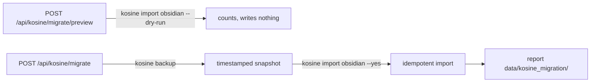

# Brain63 → KOSINE Migration Strategy

Non-destructive, reversible, and optional. Brain63 is **never deleted** and never
written; migration only *copies* vault knowledge into KOSINE via KOSINE's own
tools.

## Current Brain63 role

`Brain63Service` is a strictly read-only reader over the Obsidian vault at
`BRAIN63_VAULT_PATH` (lexical search, no writes). It is SILVIA's incumbent
grounding source and is exposed through `Brain63Provider`
(`MemoryProvider`). `conversation_service.py` also calls it directly in ~80
places (the deepest coupling point).

## Compatibility plan

SILVIA runs in any of three modes without code changes (`MEMORY_MODE`):

1. **brain63** — today's behaviour; KOSINE excluded.
2. **kosine** — KOSINE primary; Brain63 fallback.
3. **hybrid** — both queried; results deduped; conflicts **marked, not merged**.

This lets you enable KOSINE for reads with Brain63 as a safety net, validate,
then promote KOSINE — reversibly, at any time, by flipping env flags.

## Migration path (spec-compliant, CLI-driven)

SILVIA drives KOSINE's **own public CLI** as a subprocess — it never imports
`kos` and never opens the DB.

KOSINE's importer is **idempotent** (natural-key + content-hash dedup), so
re-running only applies new/changed notes. Run while the KOSINE service is idle.

## Conflict handling

- At **read** time (hybrid mode), the same (type, title) from KOSINE and Brain63
  is deduped; if content materially differs the entry is flagged
  `metadata.conflict=true` with both versions retained. The cognition layer and
  the Cognitive Graph surface conflicts (`contradiction_detected`) rather than
  silently merging.
- At **import** time, KOSINE's dedup avoids duplicating already-imported notes.

## Rollback

- `POST /api/kosine/restore {"backup_name":"…","confirm":true}` →
  `kosine restore` from the pre-migration snapshot.
- Because `migrate` always backs up first (aborting if the backup fails), any
  migration is one restore away from being undone.
- Brain63 is untouched, so reverting `MEMORY_MODE` to `brain63` instantly
  returns SILVIA to its original behaviour.

## Non-destructive requirements (guarantees)

- No Brain63 vault file is ever modified, renamed, or deleted.
- No automatic/destructive migration: preview writes nothing; migrate backs up
  first; destructive KOSINE tools are blocked at the client, at KOSINE, and by
  the apply allowlist.
- No KOSINE source is modified; SILVIA uses only KOSINE's public CLI/REST.
