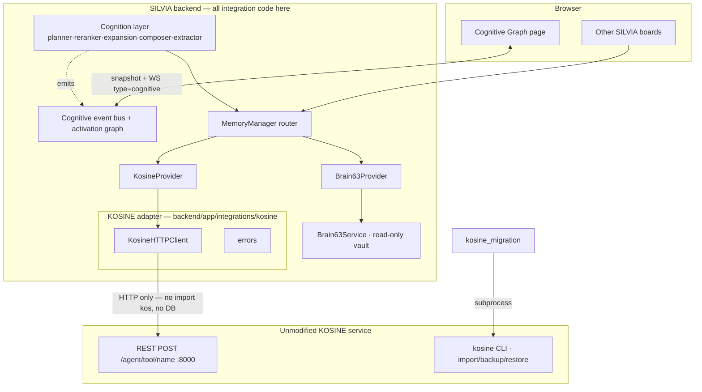
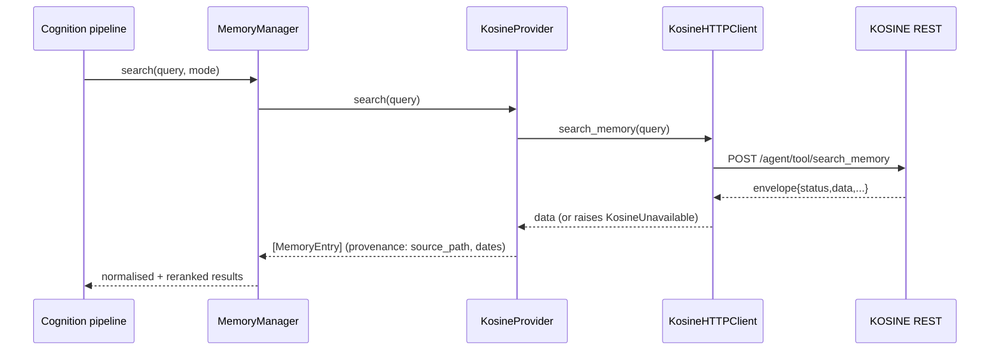

# KOSINE ↔ SILVIA — Integration Architecture

How SILVIA uses **KOSINE** as a replaceable external knowledge/memory provider,
while **Brain63** remains a safe fallback, and how SILVIA adds the cognition,
events, and interactive visualization on its own side. KOSINE runs unmodified.

## System boundaries

**Rules enforced by this design:**
- SILVIA never imports KOSINE internals and never opens KOSINE's DB. The only
  paths to KOSINE are the public **REST** contract and the public **CLI**.
- All KOSINE schema translation is confined to the adapter (`KosineHTTPClient`
  + `KosineProvider._object_to_entry`). KOSINE response dicts never spread into
  the rest of SILVIA.
- KOSINE is unaware of SILVIA and is independently restartable/replaceable.

## Provider architecture

SILVIA depends on the generic `MemoryProvider` contract
(`backend/app/memory/provider.py`): `search / get / timeline / health /
relationships / store / update / propose_write / capabilities`, returning the
canonical `MemoryEntry`, `ProviderHealth`, and `MemoryWriteProposal`.

`MemoryManager` (`backend/app/services/memory_manager.py`) is the router.
`MEMORY_MODE` selects behaviour:

| MEMORY_MODE | Read order |
|---|---|
| `` (auto, default) | flag-driven — `KOSINE_PRIMARY` promotes KOSINE, else Brain63-first + KOSINE appended |
| `brain63` | Brain63 (+ others); KOSINE excluded |
| `kosine` | KOSINE first; Brain63 demoted to fallback |
| `hybrid` | KOSINE + Brain63 (+others); deduped, conflicts **marked not merged**; one provider failing does not fail the request |

## Read flow

## Write flow (review-gated, audited)

Defaults: writes **disabled**. Destructive tools blocked at the client, at
KOSINE, and by the apply allowlist. Every write yields an audit record (actor,
reason, tool, params, objects_changed, events_created, status, error).

## Brain63 coexistence

Brain63 stays a strictly read-only Obsidian-vault reader behind
`Brain63Provider`. It is never deleted and never written. During migration it is
the fallback/secondary; after migration it remains the human-readable archive.
See `docs/brain63_migration_strategy.md`.

## Cognitive event architecture

A provider-agnostic SILVIA facility (`backend/app/services/cognition/events.py`):
typed `CognitiveEvent`s describe **observable system activity** (never model
chain-of-thought). The `CognitiveEventBus` keeps a bounded rolling buffer +
snapshot (WS does not replay), a decaying activation graph, and fans events out
to the existing WebSocket (`/api/ws/events`, `{"type":"cognitive"}`). See
`docs/cognitive_graph.md`.

## Visualization architecture

`frontend/src/pages/CognitiveGraphPage.jsx` — a Canvas force-graph that seeds
from `/api/cognitive/snapshot` and updates live from the WS stream. Node colour
by type, ring by state, size/brightness by decaying activation; inspector,
filters, three views, live/pause, provider-degradation banner, simulation
styling.

## Security

- Browser → SILVIA backend → KOSINE adapter → KOSINE. The browser never talks to
  KOSINE directly; `KOSINE_BASE_URL` and `KOSINE_API_TOKEN` stay server-side.
- Write permission is enforced on the backend (`KOSINE_ALLOW_WRITES` + approval).
- SILVIA's existing `AuthMiddleware` (localhost-exempt; `X-API-Key`/Bearer / WS
  `?api_key=`) guards the cognitive endpoints and WS like every other route.
- Event payloads carry ids/labels/reason-codes only — not secrets. Logs use the
  `silvia.*` namespace and do not dump memory content.

## Failure & degradation

- KOSINE down → `KosineHTTPClient` raises `KosineUnavailable` (bounded retries);
  `KosineProvider` degrades to `[]` / `available=False`; the router follows the
  configured fallback (Brain63). No fabricated KOSINE results.
- The Cognitive Graph shows a provider-degradation banner and never invents
  nodes for an unreachable provider.
- If both providers fail, SILVIA operates without persistent retrieval and says
  it lacks grounded information rather than guessing.
