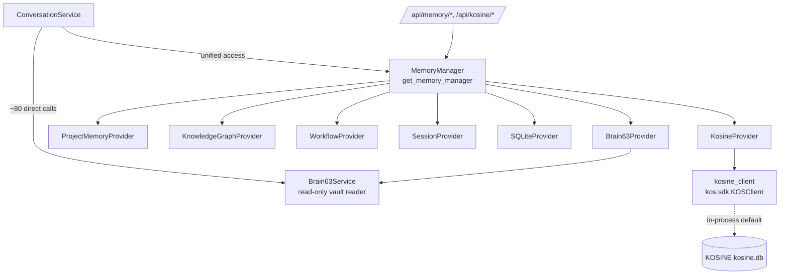
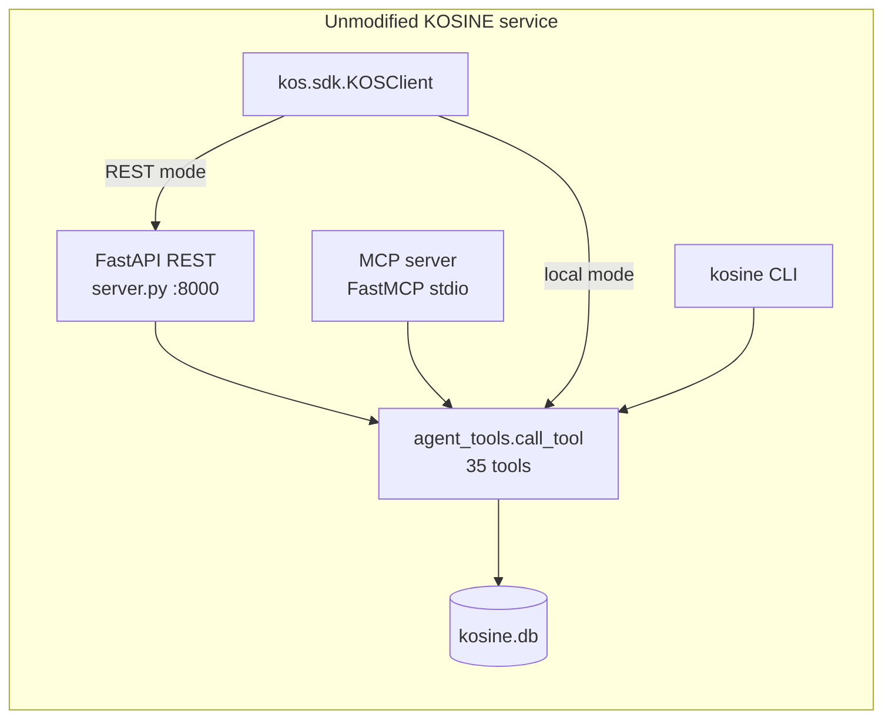
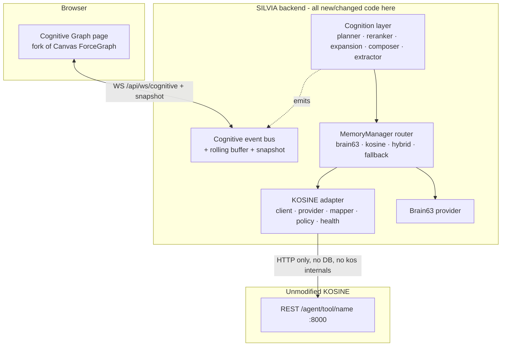

# KOSINE ↔ SILVIA Integration — Discovery Report (Phase 0)

**Status:** Discovery complete. No code changed in this phase.
**Date:** 2026-07-08
**Scope:** Establish how SILVIA currently stores/retrieves memory, what KOSINE
exposes as a *public* contract, what integration already exists on this branch,
where it conflicts with the new architectural requirements, and a staged,
file-level plan to reach the target architecture.

> **Key finding up front:** A substantial KOSINE integration already exists on
> branch `feature/kosine-memory-provider` (3 commits, ~2,139 LOC). The Phase 18A
> provider framework, a gated/audited write path, an approval workflow, a
> maintenance loop, a migration tool, 13 REST endpoints, an approval UI, and 11
> tests are already in place. **However, its default transport violates three of
> the new spec's non-negotiable rules** (it imports `kos.sdk` in-process and opens
> KOSINE's SQLite DB directly). The violation is **resolvable by configuration +
> a small adapter change**, not a rewrite, because KOSINE exposes a clean public
> REST boundary that covers every needed capability.

---

## 1. Current SILVIA memory architecture

SILVIA is a **FastAPI** app (`backend/app/main.py` → `create_app()` in
`backend/app/core/application.py`). A single god-object,
`AssistantPlatformRouter` (`backend/app/orchestration/assistant_router.py`),
is constructed in the lifespan and stored at `app.state.router`; it owns every
service. There is **no DI framework** — services are either constructor
attributes on that router, or module-level lazy singletons accessed via
`get_*()` (the dominant pattern for the memory subsystem).

The unified memory layer (**Phase 18A**, already shipped) is the relevant part:

- **`MemoryProvider` ABC** (`backend/app/memory/provider.py`): methods
  `search / get / timeline / health` (required) + `store / update / delete /
  relationships` (optional). Dataclasses `MemoryEntry` (id, provider, type,
  title, content, project, date, source, score, metadata) and `ProviderHealth`
  (name, available, entry_count, details). It has **no** named `fetch`,
  `get_neighbours`, `get_provenance`, `propose_write`, or `capabilities` — those
  spec concepts are covered functionally (`get`≈fetch, `relationships`≈
  neighbours, `MemoryEntry.source`≈provenance) or externally (write proposals
  live in the WorkflowEngine, not the provider).
- **`MemoryManager`** (`backend/app/services/memory_manager.py`): registry +
  read router. `DEFAULT_PRIORITY` orders providers; `_build_priority()` reorders
  based on `KOSINE_ENABLED` / `KOSINE_PRIMARY`. `search()` currently queries the
  whole priority list and merges by `score` — **no dedup, no conflict marking**.
- **Storage:** one SQLite file `data/cmdctr.db`, per-service
  `CREATE TABLE IF NOT EXISTS`, no migration system (~44 tables). KOSINE has its
  own separate DB.
- **Real-time:** an `EventService` (`backend/app/services/event_service.py`)
  with `emit / emit_nowait / emit_ws_only(dict)`, broadcast over WebSocket
  `/api/ws/events`. A typed-dict protocol (`{"type": ...}`) is already in use
  (`node_telemetry`, `watch_alert`, …) and consumed by a reconnecting frontend
  switch in `useCommandCenterData.js`. Chat token streaming is a *separate* SSE
  channel (`/api/chat/stream`).

## 2. Current Brain63 integration flow

Brain63 is SILVIA's incumbent grounding source: a **strictly read-only** reader
over an Obsidian vault (`BRAIN63_VAULT_PATH`, default
`C:\Users\IshaanV\Documents\GitHub\Brain63`).

- **`Brain63Service`** (`backend/app/services/brain63_service.py`): indexes
  `*.md` (skips `.obsidian`/`.git`/daily/templates), parses frontmatter, splits
  by headers into chunks, caches in-memory (TTL 300s). Search is **lexical
  keyword scoring with boosts — no embeddings, no LLM, no network**. Deterministic
  answer formatters produce "According to Brain63 (…)" strings. It never writes.
- **`Brain63Provider`** (`backend/app/memory/brain63_provider.py`): thin
  `MemoryProvider` adapter (constructs its own `Brain63Service`, so a second
  index cache exists). Read-only.
- **Coupling (the migration obstacle):** `conversation_service.py` calls
  `self.brain63_service` **directly in ~80 places** — `_brain63_context_block`
  injects "BRAIN63 FACTS — your only source for project details" into the system
  prompt; project/device/decision/status queries route to Brain63 first, static
  registry as fallback. These call sites **bypass `MemoryManager`**. Displacing
  Brain63 as the grounding source means either routing these through
  `MemoryManager` or contending with each call site.
- **Writes:** the Phase 18B "Brain63 Steward" can propose drafts, committed only
  through an approval workflow (`BRAIN_STEWARD_AUTODRAFT`, default off). The vault
  is never mutated by the service/provider.

## 3. KOSINE's available public contract

KOSINE (`C:\Users\IshaanV\Documents\GitHub\KOS`, package `kosine` v0.3.0,
Apache-2.0) is a standalone local-first SQLite memory system. **All three
integration surfaces are thin adapters over one layer**:
`kos/agent_tools.py::call_tool(db, name, params)` — **35 non-destructive tools**
(+4 destructive in a separate, opt-in registry). This is the intended public
surface (`docs/AGENT_INTERFACE.md`).

| Surface | Public? | Entry | Covers |
|---|---|---|---|
| **REST** `POST /agent/tool/{name}` + `GET /agent/tools` | ✅ canonical | `python server.py` (`127.0.0.1:8000`) | **All 35 tools**: search, fetch, `get_related`, `graph_neighborhood`, `get_graph_data`, `get_context_graph`, `get_timeline`, provenance, `get_project_knowledge`, writes, sessions |
| Narrow REST (`/objects`, `/search`, `/related`, `/timeline`, `/relationships`, `/health`, `/stats`) | ✅ | same | Subset; omits deep graph/provenance (use universal dispatch instead) |
| **MCP** `kos_*` (35 tools) | ✅ optional | `kosine service mcp` (stdio) | Non-destructive tools only |
| **SDK** `kos.sdk.KOSClient` | ✅ documented | `import kos` | Local (opens SQLite in-proc) **or** REST (`base_url`, stdlib urllib, no DB). `.call(tool, **params)` = full 35-tool access |
| **CLI** `kosine …` | ✅ | `kos.cli:main` | `service`, `import`, `export-json/graph`, data ops, `api-token` |

- **Response envelope** (every tool): `{status, tool, data, objects_changed,
  events_created, confirmation_required, error}`.
- **Data model:** 16 object types (Project, Goal, Task, Decision, Person,
  Document, …), 18 relationship types, 14 event types, 7 statuses. **ULID** ids
  (immutable, time-sortable); titles are display-only. Provenance = `source` +
  `source_path` + `created_at/updated_at` + an **append-only `events` table**.
  `confidence: float`. Relevance is computed at query time (`get_context_graph`
  returns `relevance/hop/reasons`), not stored.
- **Auth:** optional Bearer token; **default OFF (open localhost)**; destructive
  tools never served to non-local clients and require an explicit confirmation
  phrase.
- **No capability blockers:** relationship traversal, provenance, and writes are
  **all** reachable on the public REST `/agent/tool/{name}` surface.

## 4. Existing KOSINE integration inventory (this branch)

| Area | File | State |
|---|---|---|
| Transport | `backend/app/memory/kosine_client.py` | Singleton over `kos.sdk.KOSClient`; **in-process (db_path) by default**, REST when `KOSINE_BASE_URL` set; `allow_destructive=False` |
| Provider | `backend/app/memory/kosine_provider.py` | `MemoryProvider` impl: `search_memory/show_object/get_timeline/get_related/list_objects`; `store/update` gated + audited |
| Audit | `backend/app/memory/kosine_audit.py` | Single write chokepoint → `data/kosine_audit.jsonl` |
| Apply | `backend/app/services/kosine_apply.py` | Approved-suggestion executor; non-destructive allowlist `{create_memory, update_memory, create_relationship, add_event}` |
| Maintenance | `backend/app/services/kosine_maintenance.py` | Read-only scan (stale/incomplete/duplicate/orphan); drafts only if `KOSINE_MAINTENANCE_AUTODRAFT` |
| Migration | `backend/app/services/kosine_migration.py` | Brain63→KOSINE import; **reaches into `client._db`, `kos.database`, `kos.backups`, `kos.importing`** (in-process only) |
| API | `backend/app/api/kosine.py` | 13 endpoints: status/migrate/backups/restore/audit/maintenance/suggestions(+approve/reject/apply) |
| Frontend | `frontend/src/pages/KosinePage.jsx` | Status, migration, maintenance, **approval UI**, audit log |
| Tests | `backend/tests/test_kosine_apply.py` | 11 tests on the write-gate/approval contract |
| Config | `backend/config.py` (KOSINE_* block), `.env.example` | All flags default OFF |
| Docs | `docs/KOSINE_INTEGRATION.md` | Existing integration notes |

**This already satisfies large parts of the spec's Phases 1, 2, and 6** (provider
abstraction, Brain63 coexistence, read adapter, gated/audited/approval-based
writes). What's missing is Phases 3–5 (cognitive retrieval pipeline, typed
cognitive-event system, interactive Cognitive Graph, activation, simulation) and
a **spec-compliant transport boundary**.

## 5. Compatibility gaps & spec-compliance analysis

### 5.1 The architectural conflict (must-fix)

| Spec non-negotiable | Current state | Verdict |
|---|---|---|
| No importing KOSINE internal modules | `kosine_client`: `from kos.sdk import KOSClient`; `kosine_migration`: `kos.database/backups/importing`, `client._db` | ⚠️ Violated (SDK debatable; migration internals clearly) |
| No accessing KOSINE DB files directly | In-process mode opens `KOSINE_DB_PATH`; migration opens the DB | ⚠️ Violated in default mode |
| Public interfaces only (REST/MCP/CLI) | REST mode + CLI available but not the default | ✅ Achievable |
| KOSINE unaware of SILVIA / replaceable / independently restartable | True at the data level; transport coupling via shared process/DB weakens it | ⚠️ Improved by REST boundary |

**Resolution (config + small adapter change, not a rewrite):** run KOSINE as a
standalone service and point SILVIA's adapter at it over **REST**
(`POST /agent/tool/{name}`). REST mode opens **no** database and needs **no**
`kos` internals. Two strictness options for the decision log:

- **Option A (minimal):** keep `kos.sdk.KOSClient(base_url=…)` — it *is* the
  published public SDK, and in REST mode touches no DB. Smallest change.
- **Option B (strictest, recommended):** replace `kos.sdk` with a small
  SILVIA-owned HTTP client hitting `/agent/tool/{name}` directly (stdlib/httpx),
  so there is **zero `import kos`** anywhere in SILVIA. Makes "no internal
  imports" airtight and KOSINE truly swappable behind our adapter.

**Migration is the one genuine rework:** `kosine_migration.py` uses KOSINE
internals not exposed over REST. To comply, migration must move to KOSINE's own
**CLI** (`kosine import …`, which the spec explicitly permits "where no proper
runtime API exists") run as a subprocess, or be treated as an operator step run
with KOSINE's tooling. Until then it stays behind its default-OFF flags and is
documented as non-compliant/local-only.

### 5.2 Functional gaps vs. the target spec

| Spec area | Status | Gap |
|---|---|---|
| Generic MemoryProvider + router + Brain63 coexistence | ✅ exists | Additive: `capabilities()`, richer canonical models, explicit `MEMORY_MODE`, hybrid **dedup + conflict marking** |
| Read adapter (health/search/fetch/relationships/provenance) | ✅ exists | Re-base on REST boundary; add retries/backoff, correlation IDs, capability discovery via `GET /agent/tools` |
| Canonical data model | partial (`MemoryEntry`) | Add `MemoryResult / MemoryRelation / ProviderHealth / MemoryWriteProposal` (translation stays in the adapter) |
| Write safety (gate/audit/approval/policy) | ✅ strong | Fold `propose_write` into the provider contract; formalize the policy categories |
| **Cognitive retrieval** (planner, reranker, bounded expansion, composer, extractor) | ❌ none | Net-new isolated services |
| **Cognitive event system** (typed schema + bus + snapshot/replay) | ⚠️ transport only | Typed cognitive events, rolling buffer + snapshot endpoint (WS exists) |
| **Interactive Cognitive Graph** (live graph, inspector, filters, simulation, activation) | ❌ none | Net-new page (fork the existing Canvas `ForceGraph`), taxonomy, activation, simulation |
| Migration (non-destructive, reversible) | ⚠️ exists but non-compliant boundary | Move to CLI/subprocess |

## 6. Risks

1. **Operational dependency:** REST boundary requires KOSINE running as a
   service. New failure modes (connection refused, timeout) → needs robust
   degraded operation + provider-health surfacing (spec §Failure).
2. **Brain63 coupling:** ~80 direct call sites in `conversation_service.py`
   bypass `MemoryManager`; changing the grounding source is invasive. Mitigate by
   routing through `MemoryManager` rather than editing 80 sites.
3. **Event replay gap:** `emit_ws_only` dicts are not retained/replayed; the
   Cognitive Graph needs a snapshot endpoint + bounded rolling buffer, or late
   joiners see an empty graph.
4. **Migration rework** off `kos.importing` internals (§5.1).
5. **Scope:** the full spec is a multi-session build; must be staged with
   checkpoints, not one big change.
6. **Unbounded cognitive-event volume:** must bound history and NOT persist every
   reasoning event permanently (spec §Code quality).
7. **No conftest/migrations:** tests use inline `tmp_path`+`monkeypatch`; new
   tables via `CREATE TABLE IF NOT EXISTS` — follow the house pattern exactly.

## 7. Proposed integration boundary

SILVIA depends on the **generic memory contract**; all KOSINE schema translation
stays inside the adapter/mapper. KOSINE stays unmodified and independently
restartable; another AI could point its own adapter at the same service.

## 8. Proposed staged implementation

Each phase ends with: run tests · report files changed · confirm **no KOSINE
source modified**. Flags default OFF; existing behaviour stays intact.

- **Phase 1 — Provider hardening (mostly done):** formalize `capabilities()`,
  add `MEMORY_MODE=brain63|kosine|hybrid`, add hybrid **dedup + conflict
  marking**. Small, additive.
- **Phase 2 — Compliant read boundary:** make REST the default/compliant path
  (Option A or B from §5.1); add retries/backoff, correlation IDs, timeouts,
  capability discovery, malformed-response handling, provider-health. Re-point
  the existing provider at the boundary.
- **Phase 3 — Cognitive retrieval:** new isolated services — Query Planner,
  Reranker (deterministic, inspectable), bounded Relationship Expansion, Context
  Composer (budgeted), Write Extractor. Wire into the conversation path behind a
  flag.
- **Phase 4 — Cognitive events:** typed cognitive-event schema + bus (extend
  `EventService`), `/api/ws/cognitive` (or reuse `/api/ws/events` with a topic),
  rolling buffer + snapshot endpoint.
- **Phase 5 — Interactive Cognitive Graph:** fork `KnowledgeGraphPage`'s Canvas
  renderer; node/edge/state taxonomy; inspector; filters; activation (SILVIA-side,
  decaying, never written to KOSINE); simulation styling; provider-degradation
  display; Active Session / KOSINE Knowledge / Agent-Workflow views.
- **Phase 6 — Controlled writes (mostly done):** fold `propose_write` into the
  provider; keep the existing approval/audit; enable safe categories only behind
  `KOSINE_ALLOW_WRITES`.
- **Phase 7 — Hardening:** full unit/integration/frontend tests, degraded-mode,
  security review, docs (architecture, setup, cognitive_graph, migration).

## 9. Files expected to be **modified / created** (SILVIA side only)

**Modify:** `backend/app/memory/kosine_client.py` (REST-first / SILVIA HTTP
client), `backend/app/memory/kosine_provider.py` (mapper + capabilities +
provenance), `backend/app/services/memory_manager.py` (MEMORY_MODE + dedup +
conflict), `backend/app/services/kosine_migration.py` (CLI/subprocess boundary),
`backend/app/services/conversation_service.py` (cognitive hooks + emits — minimal,
additive), `backend/app/services/event_service.py` (cognitive bus/buffer),
`backend/app/core/application.py` (register new services/routers/WS),
`backend/config.py` + `.env.example` (new flags), `frontend/src/App.jsx` +
`frontend/src/components/shell/TopBar.jsx` (route + nav), `frontend/src/lib/api.js`
(cognitive endpoints/socket).

**Create:** `backend/app/integrations/kosine/` (client, provider, mapper,
schemas, capabilities, errors, policy, health, events — refactor of the existing
`kosine_*` modules into the spec package shape), `backend/app/services/cognition/`
(planner, reranker, expansion, composer, extractor), cognitive-event schema +
bus + API, `frontend/src/pages/CognitiveGraphPage.jsx` (+ components/hooks),
`backend/tests/test_kosine_adapter.py`, `test_memory_router.py`,
`test_cognition_*.py`, `test_cognitive_events.py`, and docs
(`kosine_integration_architecture.md`, `kosine_integration_setup.md`,
`cognitive_graph.md`, `brain63_migration_strategy.md`).

## 10. Files that **must NOT be modified**

- **Anything under `C:\Users\IshaanV\Documents\GitHub\KOS`** (all of KOSINE).
- The **Obsidian vault** at `BRAIN63_VAULT_PATH`
  (`C:\Users\IshaanV\Documents\GitHub\Brain63`) — read-only.
- KOSINE's databases (`kosine.db`, per-Brain `brain.db`) — never opened directly.
- The `agent/` QA harness, its test cases, and evaluator (unrelated subsystem).

## 11. Blockers

**None that require editing KOSINE.** Every capability the spec needs
(search, fetch, relationship traversal, provenance, gated writes, sessions) is
on KOSINE's public REST surface. The only items needing a decision (not a
blocker) are the two in §5.1 — the adapter-boundary strictness and the migration
path — plus scope sequencing. These are raised as questions below.

## 12. Questions that genuinely require your decision

1. **Adapter boundary strictness** — Option A (keep the public `kos.sdk` SDK in
   REST mode; smallest change) vs Option B (SILVIA-owned HTTP client, zero
   `import kos`; strictest, recommended)?
2. **Migration path** — move Brain63→KOSINE migration to KOSINE's CLI
   (spec-compliant), keep it as an explicitly local/out-of-band operator tool, or
   defer migration entirely for now?
3. **KOSINE lifecycle** — assume you run KOSINE independently (spec favors
   independence; SILVIA detects availability and degrades) vs SILVIA
   auto-launching it as a subprocess?
4. **Scope & sequencing** — this is a multi-session build. Which is the priority
   deliverable: the compliant read/write boundary (Phases 1–2, 6), or the
   interactive Cognitive Graph (Phases 3–5)? I recommend boundary-first so the
   graph visualizes a real, compliant pipeline.

---

## 13. Decisions taken & progress log

**Decisions (2026-07-08):** (1) SILVIA-owned HTTP client, zero `import kos`;
(2) boundary-first sequencing (Phases 1–2, 6); (3) migration moves to KOSINE's
CLI; (4) KOSINE runs as an independent service, SILVIA detects + degrades.

### ✅ Phase 1 (provider hardening) + Phase 2 (compliant read boundary) — done

- New package `backend/app/integrations/kosine/` — a SILVIA-owned HTTP client
  (`KosineHTTPClient`, stdlib `urllib`, **no `import kos`**) speaking KOSINE's
  public `POST /agent/tool/{name}` + `GET /agent/tools` + `GET /health`. Handles
  timeouts, bounded exponential-backoff retries, correlation IDs, optional Bearer
  auth, capability discovery, a destructive-tool guard, and typed error
  translation (`errors.py`).
- `kosine_client.py` now defaults to this REST client; `kos.sdk` is confined to
  an explicit legacy `KOSINE_TRANSPORT=local` path (migration/dev only) — verified
  `kos` is **not** in `sys.modules` after importing the whole memory stack.
- `MemoryProvider.capabilities()` added (base + Brain63 + KOSINE).
- `MemoryManager`: `MEMORY_MODE` (auto|brain63|kosine|hybrid), hybrid
  deterministic **dedup + conflict marking** (never silent-merges), one provider
  failing no longer fails the request, capabilities exposed in the listing.
- Config: `MEMORY_MODE`, `KOSINE_TRANSPORT`, default `KOSINE_BASE_URL`,
  `KOSINE_TIMEOUT_SECONDS`, `KOSINE_MAX_RETRIES`, `KOSINE_API_TOKEN`;
  `.env.example` updated. All flags default OFF / backward compatible.
- Tests: `test_kosine_http_client.py` (16) + `test_memory_router.py` (9) added,
  all pass; existing `test_kosine_apply.py` (11) green (fixture pinned to
  `local` transport). No KOSINE source modified.

### ✅ Boundary tails + Phase 3 (cognitive retrieval) + Phase 4 (cognitive events) — done

- **Migration → KOSINE CLI** (decision 3): `kosine_migration.py` now shells out to
  `kosine import obsidian / backup / backups / restore` (via `--db`), zero
  `import kos`, zero direct DB access. Same public function signatures.
- **`propose_write` folded into the provider contract**: `MemoryWriteProposal`
  model + base method; `KosineProvider.propose_write` drafts a review-gated
  `kosine_suggestion` workflow (reuses the existing approval + audit + apply
  path). Writes still gated by `KOSINE_ALLOW_WRITES` + human approval.
- **Phase 4 — cognitive event system** (`backend/app/services/cognition/`):
  typed `CognitiveEvent` (31 event types) carrying only inspectable reason
  codes/explanations (no chain-of-thought); `CognitiveEventBus` (bounded rolling
  buffer + snapshot for late joiners + fan-out); `CognitiveGraphState` (decaying
  activation graph, bounded). Wired to the existing WS `/api/ws/events`
  (`{"type":"cognitive"}`) at startup. API `/api/cognitive/{snapshot,events,
  query,extract,reset,health}`.
- **Phase 3 — cognitive retrieval pipeline**: `MemoryQueryPlanner`,
  `MemoryReranker` (deterministic, inspectable breakdown), `RelationshipExpander`
  (bounded: depth/nodes/relations/cycle-safe), `ContextComposer` (budgeted,
  selected/rejected/conflicts), `MemoryWriteExtractor` (categorized, review-gated),
  and `CognitionPipeline` orchestrating plan→search→rerank→expand→compose while
  emitting the graph event stream. Read-only w.r.t. providers.
- **Tests:** +35 (`test_cognitive_events.py` 15, `test_cognition_pipeline.py` 20);
  all 60 new-feature tests green. No KOSINE source modified.

### ✅ Phase 5 (interactive Cognitive Graph) + Phase 7 (hardening) — done

- **Phase 5:** `frontend/src/pages/CognitiveGraphPage.jsx` — a self-contained
  Canvas force-graph seeded from `/api/cognitive/snapshot` and updated live from
  the `{"type":"cognitive"}` WS stream. Node colour by type, ring by state,
  size/brightness by decaying activation; node inspector (provenance, rerank
  breakdown, why-selected, relationships); type/provider filters; three views
  (Active Session / KOSINE Knowledge / Agents & Workflows); live/pause; run-query
  box; clear-view (transient only); provider-degradation banner; dashed
  simulation styling; a prominent "not model chain-of-thought" disclaimer. Route
  `/cognitive` + TopBar nav (+ KOSINE). Frontend builds clean.
- **Phase 7:** `test_kosine_provider_integration.py` (SILVIA↔mocked KOSINE read
  path, degradation, malformed response, runtime no-`import-kos` assertion). Docs:
  `kosine_integration_architecture.md`, `kosine_integration_setup.md`,
  `cognitive_graph.md`, `brain63_migration_strategy.md`. `.env.example` finalized.
- **Totals:** 66 new tests green; KOSINE source unchanged; `kos` not imported at
  module load. **All phases (0–7) complete.**
